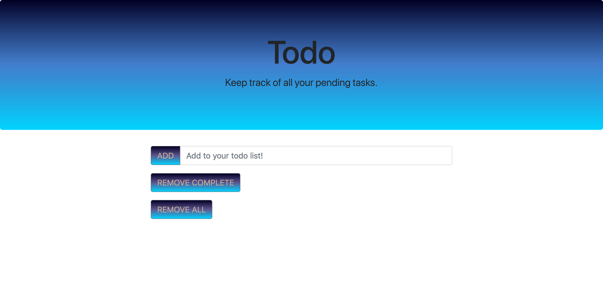
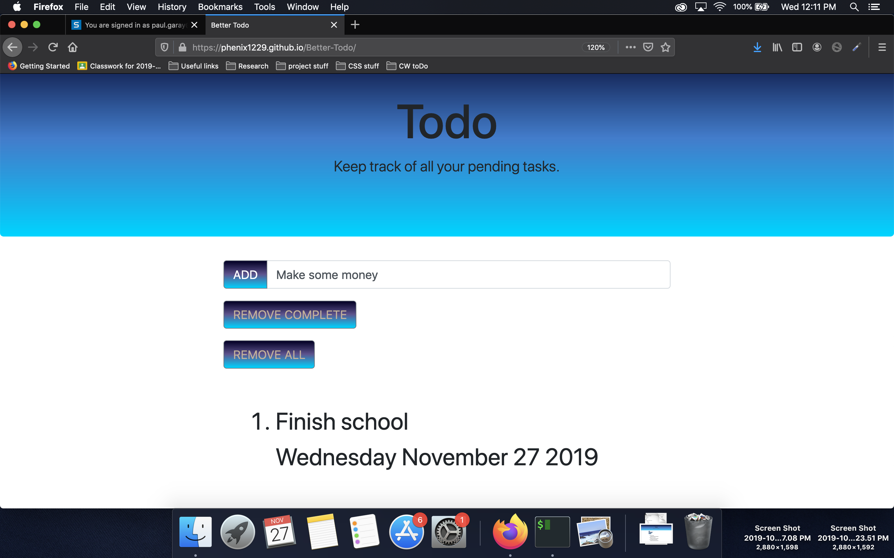
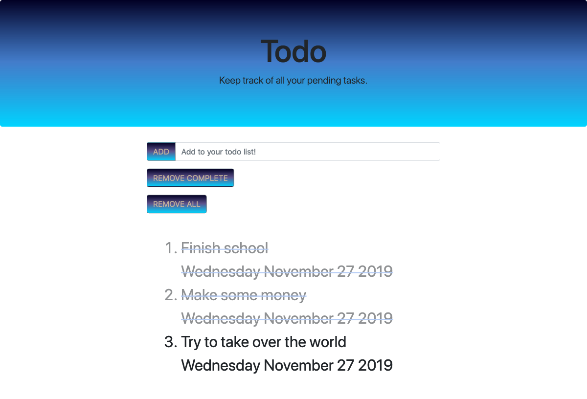

# Better-Todo

The object of this project was to collaborate on the creation of a simple to do app. My partner Jon and I worked together to make the app shown above.

To use, simply type an item into the input box and click 'ADD' as shown:

As you complete items, simply click on them to mark them as done:

After marking items complete, you can un-mark them (if you decide they are not, in fact, done), or choose to remove them completely from the list by clicking on 'REMOVE COMPLETE':

Finally, if you complete all your tasks, or just want to clear the list entirely, click 'REMOVE ALL':

On behalf of Jon and myself, thank you for stopping by.